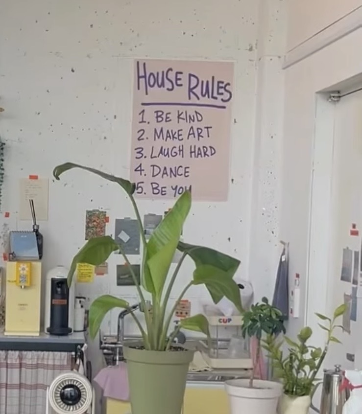
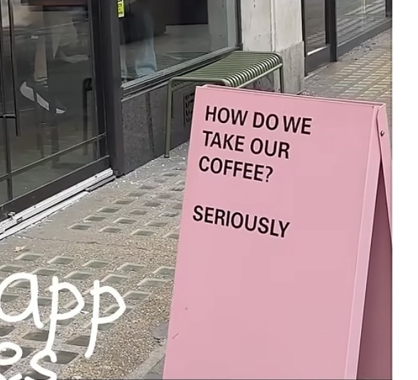

# Space Inspiration｜线下店布置参考

## 用途

记录未来线下空间可能参考的视觉灵感。

当前只作为 Parking Lot 保存，不进入 Space 执行，不创建任务。

## House Rules 风格墙面

类型: Visual Inspiration

状态: Parking Lot / Visual Inspiration

暂不开发。

### 参考图片

### 喜欢原因

希望未来在线下空间加入类似 House Rules 的墙面文字元素。

特点:

- 手写字体感。
- 简单排版。
- 留白。
- 有生活感和温度。
- 像空间里的生活准则，而不是商业标语。

### 未来可能应用

- Landing Room。
- Arrival。
- Cafe。

### 当前原则

仅记录为线下店布置参考。

不影响当前 Space、Session、Product 开发节奏。

## Outdoor Sign Board｜门口立牌

类型: Visual Inspiration

状态: Parking Lot / Visual Inspiration

暂不开发。

### 参考图片

### 喜欢原因

未来希望店门口可以有类似风格的独立立牌。

特点:

- 简单文字表达。
- 强视觉识别。
- 有一点幽默感或品牌态度。
- 像生活方式品牌，而不是商业广告。

### 注意

参考的是形式和氛围。

未来文字需要重新设计，符合 Piano by Her 品牌语言。

### 可能应用位置

- 店铺入口。
- 门口区域。

### 当前原则

仅记录为线下店布置参考。

不影响当前 Space、Session、Product 开发节奏。
